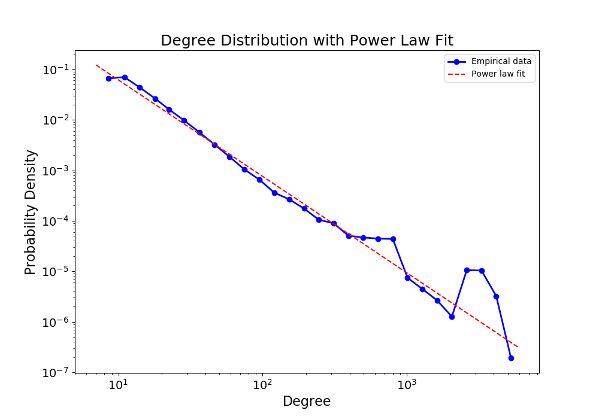
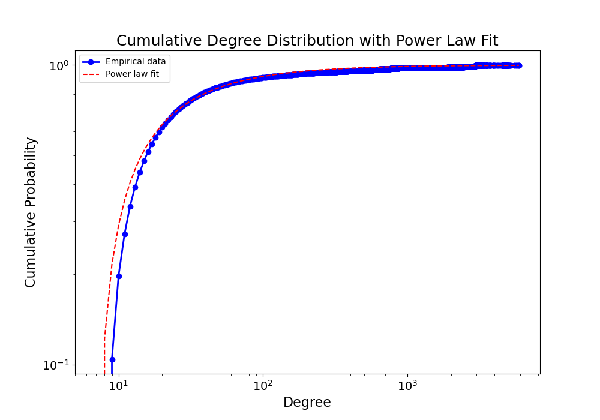

# Social network analysis of Alzheimer research collaboration network

## Abstract

## Introduction

Alzheimer's disease is a progressive and irreversible neurological disorder that affects the brain, leading to cognitive decline and memory loss. It is the most common cause of dementia, which is an umbrella term for several diseases resulting in a decline in mental ability severe enough to interfere with daily life.

Age is the most significant known risk factor for dementia, however it is essential to note that dementia is not a normal part of aging. Alzheimer's more frequently affects adults over 65 years old, with a higher prevalence in women.

According to the World Health Organization (WHO) data, Alzheimer's affects more than 55 million people worldwide. Even more striking is the data suggesting that the numbers are growing on a daily basis, with a projection reaching 78 million by 2030 (citazione).

Up to now, there are no therapies that can halt or reverse the illness, and all available therapies aim to mitigate the symptoms.

Alzheimer's disease poses a significant and growing public health challenge, emphasizing the critical need for ongoing research to better understand its underlying mechanisms, develop effective treatments, and ultimately find a cure. 

Graph theory, and particularly social network analysis, are crucial tools for evaluating the quality and effectiveness of research in this field. In our project, we utilized tools developed in graph theory to systematically analyze the structure of the Alzheimer's disease collaboration network. Furthermore we used the
Louvain algorithm for performing a community detection.

(Qui io ripercorrerei velocemente quello che abbiamo fatto e scriverei come abbiamo strutturato il resto della relazione).

## Materials and Methods 

### Dataset
### Construction of the authors collaboration network

We start by constructing the author-paper bipartite network $ G = (U, V, E)$, where the disjoint and independent sets of nodes $U$ and $V$ represent authors and papers, while the links between them denote the authorship relation. 
Subsequently, we derive the coauthorship collaboration network from the original bipartite network by projecting it onto the set of author nodes. 

Ih this new graph, denoted as $G' = (V, E)$, each author is represented by a vertex $v_i$, while the existence of an edge between two different authors means that there exists at least one path between them in the original bipartite graph $G'$, indicating a shared paper.

We decided to employ a weighted projection of $G$ to obtain $G'$. The weight of each edge corresponds to the number of common nodes in the original bipartite graph $G$, reflecting the number of papers authors have published together. 

This network structure aligns with the concept that frequent collaborators should exhibit stronger connections in the coauthorship collaboration network compared to authors with fewer shared publications.

...
(Qui dobbiamo scrivere anche che abbiamo tolto dal grafo i nodi isolati e forse anche il fatto che usiamo il reciproco dei pesi quando calcoliamo grandezze che usano il percorso più corto tra due nodi.)

### Small world-ness and scale free property

#### The scale free property 

One of the notable models for complex networks is the **scale-free network**, characterized by a degree distribution that follows a heavy-tailed power law. 
This implies an abundance of nodes with degrees significantly higher than the average, and this property is associated with the network's **robustness**. 
To investigate this, we analyzed the power-law degree distribution of the coauthorship collaboration network using methods outlined in (*citation*).

The analysis involves the following steps:

1. Firstly, we fit the tail of the empirical distribution of the degree with a power-law distribution:

$$
p(d) \propto d^{-\alpha}
$$

Here, \( \alpha \) is a constant parameter, typically \( 2 < \alpha < 3 \). 
In our context, \( d \) represents the degrees of nodes, and \( p(d) \) represents the probability degree distribution of the network, 
normalized to one. 
In most cases, the power law model is applicable only on the tail of the empirical distribution, 
meaning for degrees greater than a minimum d_{\text{min}}. 
The fitting function will be characherized by an estimated scaling parameter $\hat{\alpha}$ and the lower 
bound $d_{\text{min}}$ .
Then we compute the value $D$ of the Kolmogorov-Smirnov (KS) statistics for this fit, which is interpreted as a "distance"
between the empirical distribution and the fitted power law.

Then, in order to assess the goodness of the fit, we use the following procedure:

2. We generate a substantial number of synthetic datasets mimic the distribution of the empirical data below \(d_{\text{min}}\) 
while following the fitted power law above \(d_{\text{min}}\). 
In particular, we generate from the fitted power law a number of synthetic datasets equal to the number of elements in the 
original dataset which have degree greater than \(d_{\text{min}}\); while for the remaining elements we sample uniformly at random
from the observed data set that have degree less than \(d_{\text{min}}\).

3. We individually fit each synthetic dataset to its own power-law model and calculate the KS statistic for each 
one relative to its own model.

4. Finally, the goodness of the fit is assessed through the *p-value*,  which is computed as the fraction 
of times the KS statistics of the syntetic datases is larger than the observed KS distance. 
The *p-value* is therefore interpreted as a measure of the plausibility of the hypothesis that our data conforms 
to a power-law distribution. 

A large *p-value* suggests that the difference between empirical data and the model can be attributed to 
statistical fluctuations. Conversely, if the *p-value* is smaller than a specified threshold (in our case, \(0.1\)),
the model does not provide a plausible fit for the data, and the hypothesis is rejected.
To achieve accuracy to about two decimal places, we generate \(2500\) synthetic sets. 

##### Scale free property results

The results of the analysis are summarized in the following table:

| Parameter | Value |
| --- | --- |
| $\hat{\alpha}$ | 1.91 |
| $d_{\text{min}}$ | 7 |
| $D$ | 0.029 |

The plot of the empirical degree distribution and the fitted power law is shown in the figure below:

Instead, the plot of the cumulative distribution function (CDF) of the empirical data and the fitted power 
law is shown in the figure below:

We found that the *p-value* is equal to 0.0, which is smaller than the threshold of 0.1. 
Therefore, we reject the hypothesis that the data conforms to a power-law distribution.

### Characteristic of the authors collaboration network

### Indentification of the most influential nodes

### Community detection and Louvain algorithm

## Results

Per ora i risultati li ho messi nella sezione Materials and Methods, ma poi li sposterò qui.

## Discussion

## Conclusion